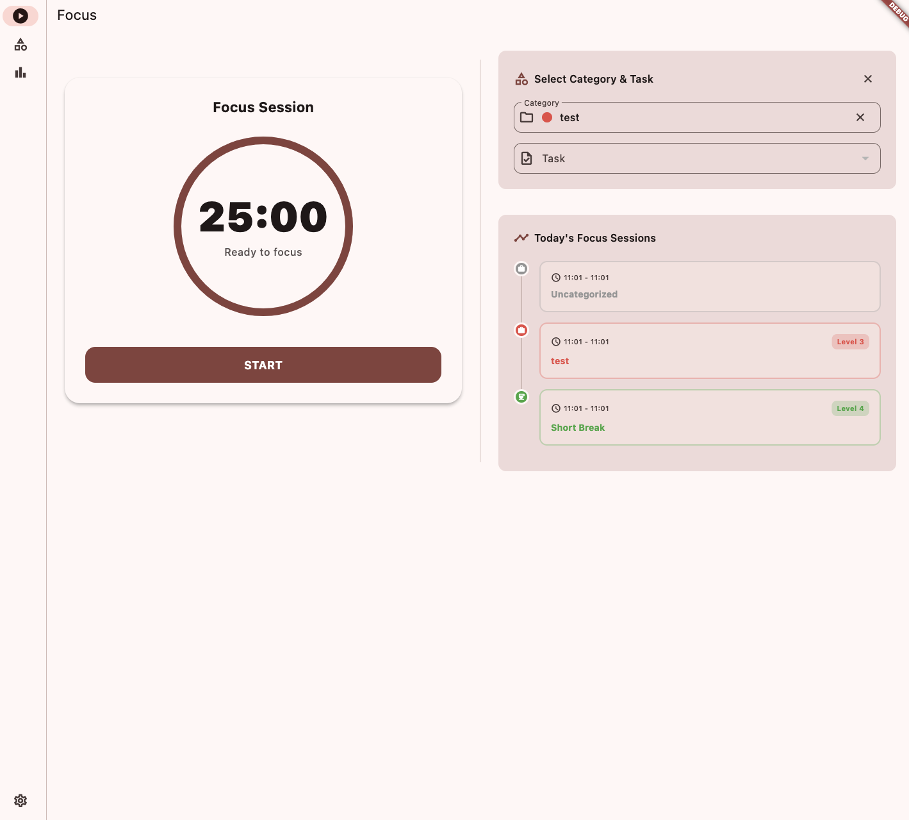
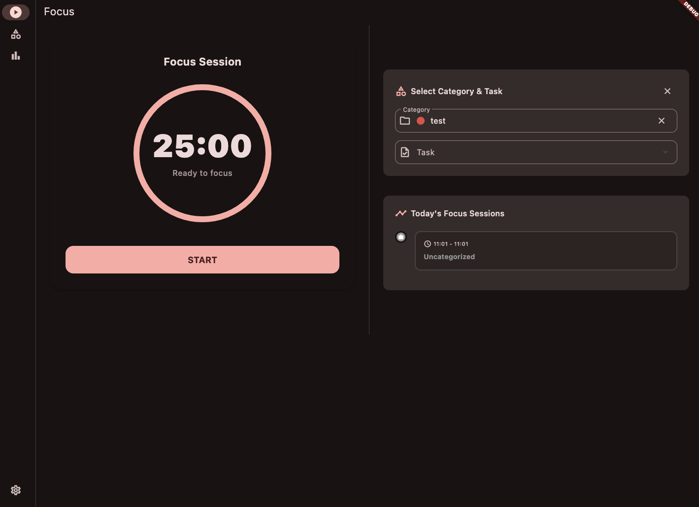
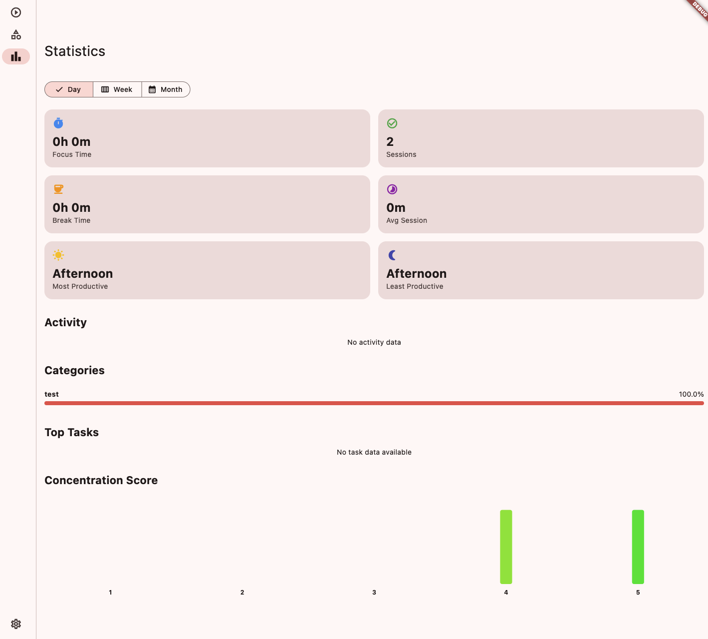
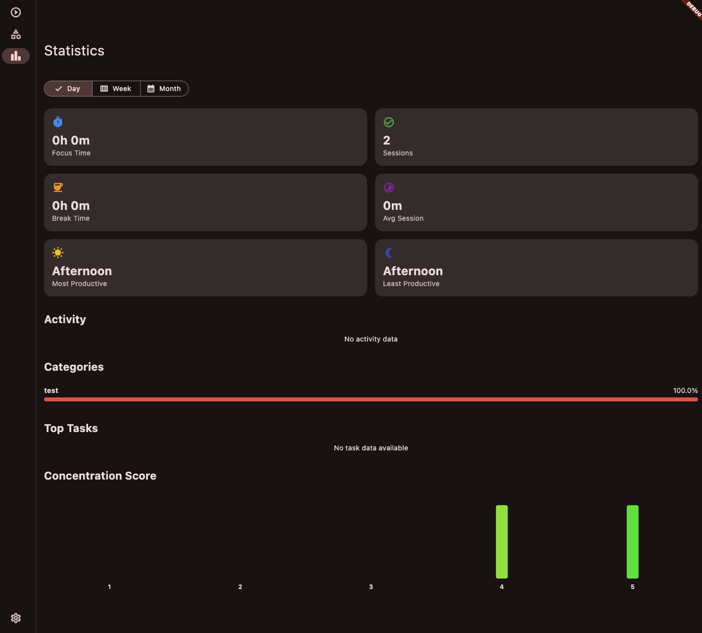

# Focus Flow

[](LICENSE)

This is the official Flutter client for [FocusFlow Cloud](https://github.com/francesco-gaglione/focus_flow_cloud), a backend service for Pomodoro technique tracking. I built this application to manage my focus sessions and tasks across my devices, and I'm sharing it for others who might find it helpful.

## 🎯 What is Focus Flow?

Focus Flow is a mobile application designed to help you implement the Pomodoro technique for time management. It connects to the FocusFlow Cloud backend to track your work sessions and breaks, provide statistics on your productivity, and allow you to organize tasks into categories.

This is the app I use daily to manage my own focus time, and it's designed to be a clean, intuitive, and robust companion for the backend service.

## 🚀 Features

- **Clean Pomodoro Timer**: A beautiful and simple timer to manage your work and break cycles.
- **Task & Category Management**: Organize your tasks within colored categories to keep your work structured.
- **Real-time Sync**: Uses WebSockets to synchronize your session state across multiple clients instantly.
- **Productivity Statistics**: Visualize your focus patterns with charts and detailed stats.
- **Multi-language Support**: Available in English and Italian.
- **Light & Dark Mode**: Adapts to your system's theme for comfortable viewing.
- **Clean Architecture**: A well-structured and maintainable codebase.

## 📸 Screenshots

|         Light Mode         |         Dark Mode         |
| :------------------------: | :-----------------------: |
|  |  |
|  |  |

## 🛠️ Tech Stack

- **Framework**: Flutter
- **Architecture**: Clean Architecture
- **State Management**: `flutter_bloc`
- **Navigation**: `go_router`
- **Dependency Injection**: `get_it`
- **HTTP Client**: `dio`
- **Localization**: `easy_localization`
- **Immutability**: `freezed`

## 🏗️ Architecture

The project follows Clean Architecture principles, separating concerns into distinct layers:

```
lib/
├── adapters/       # Data transfer objects (DTOs), repositories, and external service integrations
├── domain/         # Core business logic, entities, and repository interfaces
├── presentation/   # UI (screens/widgets) and state management (Blocs)
├── core/           # Shared utilities, dependency injection, and theme
└── main.dart       # Application entry point
```

## 🚀 Getting Started

### Prerequisites

- Flutter SDK (3.7.0 or higher)
- A running instance of the [FocusFlow Cloud](https://github.com/francesco-gaglione/focus_flow_cloud) backend.

### Quick Start

1.  **Clone the repository**:

    ```bash
    git clone https://github.com/your-username/focus_flow_app.git
    cd focus_flow_app
    ```

2.  **Set up environment variables**:
    Create a `.env` file in the root of the project and add the following, pointing to your backend instance:

    ```
    BASE_URL=http://localhost:8080
    WS_URL=ws://localhost:8080/ws/
    ```

3.  **Install dependencies**:

    ```bash
    flutter pub get
    ```

4.  **Run code generation**:
    This is required to generate files for `freezed` and `json_serializable`.

    ```bash
    dart run build_runner build --delete-conflicting-outputs
    ```

5.  **Run the application**:
    ```bash
    flutter run
    ```

## 🤝 Contributing

I'm happy to accept suggestions and improvements from the community! Feel free to open issues or submit pull requests if you find bugs or have ideas for enhancements.

## 📝 License

This project is licensed under the MIT License - see the LICENSE file for details.

## 🙏 Acknowledgments

- Built with [Flutter](https://flutter.dev/)
- State management by [flutter_bloc](https://pub.dev/packages/flutter_bloc)
- Navigation by [go_router](https://pub.dev/packages/go_router)
